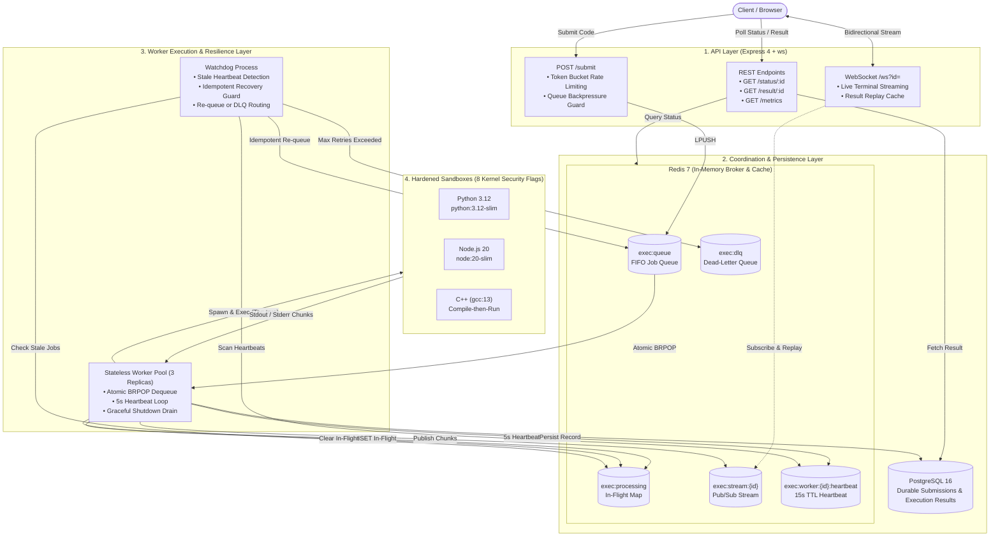

# Distributed Sandboxed Code Execution Engine (v2)


A distributed backend that accepts **Python, Node.js (JavaScript), and C++** code via REST, executes it inside Docker sandboxes enforced by **8 Linux kernel security constraints**, streams terminal output in real-time over **WebSocket (Redis Pub/Sub)**, stores persistent execution records in **PostgreSQL**, and self-heals worker crashes using a **heartbeat watchdog with idempotency guards**.

---

## Architecture



---

## 15 Core Features

| # | Feature | Scope & Implementation |
|---|---------|------------------------|
| 1 | **Docker Sandbox Execution** | `dockerode` creation, execution, and cleanup across isolated containers. |
| 2 | **8 Kernel Security Flags** | Hardened container runtime preventing fork bombs, network access, RAM exhaustion, and privilege escalation. |
| 3 | **Wall-Clock Timeout Enforcement** | Per-job configurable timeout (default 5s for run, 10s max for C++ compile). |
| 4 | **Redis FIFO Queue** | High-throughput async job distribution via atomic `LPUSH` and `BRPOP`. |
| 5 | **Stateless Async Loop** | Non-blocking execution loop in worker processes for isolated background processing. |
| 6 | **PostgreSQL Persistence** | Relational persistence for submission metadata and detailed execution records. |
| 7 | **Token Bucket Rate Limiting** | Per-IP token bucket protection against API abuse. |
| 8 | **Multi-Language Support** | Full support for **Python, Node.js (JavaScript), and C++** (compile-then-run model). |
| 9 | **Stateless Worker Pool** | Scale horizontally with $N$ worker replicas (default 3) competing on atomic `BRPOP`. |
| 10 | **Real-Time Output Streaming** | Line-by-line streaming via container `Tty: true` + Redis Pub/Sub + WebSocket endpoint (`/ws?id=`). |
| 11 | **Heartbeat Watchdog & Idempotent Recovery** | 5s worker heartbeats; watchdog detects crashed workers, checks `exec:result:{id}` before re-queueing to prevent double-execution, and routes unrecoverable jobs to `exec:dlq`. |
| 12 | **Atomic Lua Rate Limiter** | Single Lua script (`lib/rate-limit.lua`) eliminating read-modify-write race conditions. |
| 13 | **Prometheus `/metrics` Exposition** | Standard `/metrics` endpoint exposing queue depth, DLQ depth, and end-to-end execution duration histograms. |
| 14 | **Request ID Propagation** | `crypto.randomUUID()` generated at API boundary, attached to headers, stored in Redis, and propagated to all Pino worker logs. |
| 15 | **Graceful Shutdown & Queue Backpressure** | Worker drains in-flight jobs on `SIGTERM`/`SIGINT` (30s grace period); `POST /submit` returns `503 Service Unavailable` with `Retry-After: 30` when queue is full. |

---

## Kernel-Enforced Container Security

Every sandbox container is launched with **8 mandatory Linux kernel security flags**:

| Security Flag | Configuration | Threat Prevented |
|---------------|---------------|------------------|
| `--memory` | `256m` | RAM exhaustion / OOM bomb crashing the host node |
| `--memory-swap` | `256m` | Swap-space bypass of memory limits |
| `--pids-limit` | `50` | Process fork bombs (e.g., `:(){ :\|:& };:`) during compile or run |
| `--network=none` | Disables network stack | Data exfiltration, SSRF, reverse shell connections, crypto mining |
| `--read-only` | Immutable root filesystem | Disk tampering, malware persistence, unauthorized bin overwrites |
| `--tmpfs /sandbox:16m` | RAM-backed 16MB mount | Restricts writable disk space to prevent disk fill attacks |
| `--user=65534` | Non-root `nobody` user | Container breakout & host filesystem privilege escalation |
| `--cap-drop=ALL` | Drops all Linux capabilities | Exploitation of kernel capabilities (e.g., `CAP_SYS_ADMIN`, `CAP_PTRACE`) |

---

## Measured Performance Benchmarks

Measured end-to-end wall-clock latency (from `POST /submit` to `status = 'done'`, including queueing, container creation, execution, and persistence):

| Language | min | avg | **p50 (median)** | **p95** | max | Notes |
|----------|-----|-----|------------------|---------|-----|-------|
| **Python** | 512 ms | 523 ms | **516 ms** | **581 ms** | 581 ms | `python:3.12-slim` |
| **Node.js (JS)** | 513 ms | 622 ms | **518 ms** | **1043 ms** | 1043 ms | `node:20-slim` |
| **C++** | 512 ms | 926 ms | **1021 ms** | **1525 ms** | 1525 ms | `gcc:13-slim` (compile phase + run phase) |

> *Tested on Apple Silicon / Docker Desktop with Redis 7 & PostgreSQL 16.*

---

## API & WebSocket Reference

### 1. `POST /submit`
Submit code for execution.

**Headers:**
```http
Content-Type: application/json
x-api-key: test-api-key-dev-only
```

**Request Body:**
```json
{
  "code": "for i in range(3):\n    print(f'Hello {i}')",
  "language": "python"
}
```

**Response `202 Accepted`:**
```json
{
  "id": "0108ed6b-e1e5-49cb-a698-a6ef177078f2",
  "requestId": "2e3c043a-c242-476b-8dc8-2a958e85173a",
  "statusUrl": "/status/0108ed6b-e1e5-49cb-a698-a6ef177078f2"
}
```
*Response Header:* `x-request-id: 2e3c043a-c242-476b-8dc8-2a958e85173a`

---

### 2. WebSocket Streaming `/ws?id=<submissionId>`
Open a WebSocket connection to stream output line-by-line while execution is in progress.

```javascript
const ws = new WebSocket('ws://localhost:3000/ws?id=0108ed6b-e1e5-49cb-a698-a6ef177078f2');

ws.onmessage = (event) => {
  const msg = JSON.parse(event.data);
  if (msg.type === 'chunk') {
    console.log('Streamed output:', msg.data);
  } else if (msg.type === 'done') {
    console.log('Execution finished:', msg.result);
    ws.close();
  }
};
```

---

### 3. `GET /status/:id`
Poll submission status (REST fallback).

```json
{
  "id": "0108ed6b-e1e5-49cb-a698-a6ef177078f2",
  "status": "done"
}
```
*Statuses:* `pending` | `running` | `done` | `failed` | `timeout`

---

### 4. `GET /result/:id`
Fetch complete execution details once terminal.

```json
{
  "submissionId": "0108ed6b-e1e5-49cb-a698-a6ef177078f2",
  "stdout": "Hello 0\nHello 1\nHello 2\n",
  "stderr": "",
  "compileStdout": null,
  "compileStderr": null,
  "exitCode": 0,
  "runtimeMs": 443,
  "timedOut": false
}
```

---

### 5. `GET /metrics`
Prometheus text-format endpoint (unauthenticated for metric scrapers).

```prometheus
# HELP exec_queue_depth Number of jobs currently waiting in the execution queue (exec:queue)
# TYPE exec_queue_depth gauge
exec_queue_depth 0

# HELP exec_execution_duration_ms End-to-end job execution duration in milliseconds, by language and terminal status
# TYPE exec_execution_duration_ms histogram
exec_execution_duration_ms_bucket{le="500",language="python",status="done"} 1
exec_execution_duration_ms_sum{language="python",status="done"} 443
exec_execution_duration_ms_count{language="python",status="done"} 1

# HELP exec_dlq_depth Number of permanently failed jobs in the dead-letter queue (exec:dlq)
# TYPE exec_dlq_depth gauge
exec_dlq_depth 0
```

---

## Known Architectural Gaps & Trade-offs

1. **Docker Cold Start (300–500ms):**
   > No pre-warmed container pool is maintained. Every execution pays container creation cost. This is an intentional architectural trade-off to ensure clean security isolation without background resource consumption.
2. **Unpersisted Redis Queue:**
   > Redis is run in default in-memory mode without AOF configured. A full Redis node crash would lose queued jobs.
3. **Single API Key Authentication:**
   > Uses a single hardcoded `API_KEY` validated via HTTP header rather than full JWT/OAuth2.

---

## Quick Start & Service Orchestration

### 1. Start Core Infrastructure (Redis & PostgreSQL)
```bash
cd infra
docker-compose up -d redis postgres
cd ..
```

### 2. Start Application Processes
```bash
# Terminal 1: API Server (Express + WebSocket + /metrics)
npm run api

# Terminal 2: Worker Process (or run 3 replicas via Docker Compose)
npm run worker

# Terminal 3 (Optional): Watchdog Process (Heartbeat Scanner)
npm run watchdog

# Open web console in browser
open http://localhost:3000
```

### 3. Production Deployment with Docker Compose
To run all services (Express API, 3 worker replicas, Redis, PostgreSQL, and Watchdog) in production:
```bash
# 1. Build sandbox isolation images
npm run build:sandboxes

# 2. Launch the complete distributed engine
cd infra
docker compose up -d
```
---

## Test & Acceptance Gate Verification

Every architectural claim is backed by automated verification suites. Refer to the table below for required background services:

| Test Suite | Command | Required Services / Terminals | What Is Verified |
|---|---|---|---|
| **Resilience & Concurrency (Stage C)** | `npm run test:stage-c` | `redis`, `postgres`, `npm run api` | 50 concurrent requests on Lua token bucket (0 over-allows), queue backpressure (503 + `Retry-After: 30`), kill -9 orphan recovery, watchdog idempotency result check, and DLQ escalation. |
| **Graceful Shutdown** | `npm run test:shutdown` | `redis`, `postgres`, `npm run api`<br/>*(Stop standalone worker first)* | Submits 4s sleep job, sends `SIGTERM` to dedicated worker, verifies worker drains active container (~4s) and exits `0` cleanly. |
| **Observability & REST (Stage D)** | `npm run test:stage4` | `redis`, `postgres`, `npm run api`, `npm run worker` | Request ID propagation (`x-request-id`), REST poll & result fetch, 401 auth rejection, Prometheus `/metrics` histogram observation, burst 429. |
| **Multi-Language Sandboxes** | `npm run test:languages` | `redis`, `postgres`, `npm run worker` | Execution across Python 3.12, Node.js 20, and C++ (`gcc:13` compile phase + run phase). |
| **WebSocket Real-Time Streaming** | `npm run test:websocket` | `redis`, `postgres`, `npm run api`, `npm run worker` | Live line-by-line chunk streaming via Redis Pub/Sub and late-client replay cache from `exec:result:{id}`. |


---

## License

[MIT](LICENSE)
