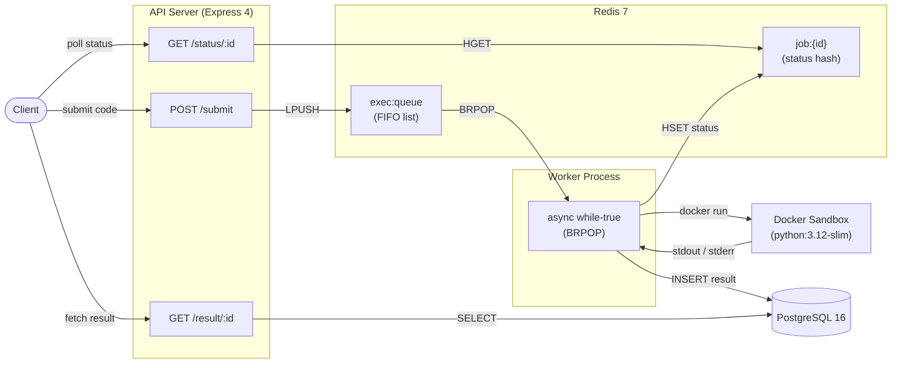

# Sandboxed Code Execution Engine


## What It Does

Backend service that accepts Python code via REST, executes it in a sandboxed Docker container with 8 kernel-enforced security constraints, stores results in PostgreSQL, and provides polling-based status updates. Built as a placement project to demonstrate systems design, container security, and async job processing.

## Architecture



## Security Constraints

Every sandbox container is launched with **8 kernel-enforced flags** — no code change can bypass these:

| Flag | Value | Prevents |
|------|-------|----------|
| `--memory` | `256m` | RAM exhaustion / OOM bomb crashing the host |
| `--memory-swap` | `256m` | Bypassing RAM limit via swap space |
| `--pids-limit` | `50` | Fork bombs (e.g., `:(){ :\|:& };:`) |
| `--network=none` | — | Data exfiltration, reverse shells, crypto mining |
| `--read-only` | — | Filesystem tampering, malware persistence |
| `--tmpfs /sandbox:16m` | 16MB RAM-backed | Limits writable space; prevents disk fill attacks |
| `--user=65534` | `nobody` | Privilege escalation, host filesystem access |
| `--cap-drop=ALL` | — | Kernel exploits via Linux capabilities (mount, ptrace, etc.) |

## Design Decisions

**Why Redis LPUSH/BRPOP instead of PostgreSQL polling?**

BRPOP is a blocking pop — the worker sleeps with zero CPU until a job arrives. PostgreSQL polling requires periodic SELECT queries that waste connections and add latency. Redis lists give O(1) push and pop with built-in blocking semantics.

**Why a separate worker process instead of in-process execution?**

Docker containers can hang, OOM, or crash. If execution ran inside the API process, a stuck container would block all incoming requests. A separate worker process isolates failure — if the worker crashes, the API continues accepting submissions.

**Why token bucket rate limiter instead of a simple counter?**

A counter resets to zero at window boundaries, allowing burst traffic at the reset moment. Token bucket smooths traffic by refilling tokens at a constant rate, preventing sudden spikes and providing fairer rate limiting.

**Why REST polling instead of WebSockets?**

WebSockets add connection management complexity (reconnection, heartbeats, state tracking). For a placement project with ~2 second execution times, polling every 2 seconds with a simple GET request is simpler, stateless, and easier to debug with curl.

**Why one worker loop instead of a thread pool?**

One loop means one job at a time — easy to reason about, no race conditions, no shared state. If throughput becomes an issue, horizontal scaling (multiple worker processes) is simpler than managing a thread pool with complex synchronization.

## API Reference

### `POST /submit`

Submit a Python code snippet for execution.

**Headers:**

```
Content-Type: application/json
x-api-key: <key>
```

**Request Body:**

```json
{
  "code": "print('hello')",
  "language": "python"
}
```

**Response `202 Accepted`:**

```json
{
  "id": "b3f1a2c4-5d6e-7f80-9a1b-2c3d4e5f6a7b",
  "statusUrl": "/status/b3f1a2c4-5d6e-7f80-9a1b-2c3d4e5f6a7b"
}
```

| Status Code | Meaning |
|-------------|---------|
| `202` | Submission accepted and queued |
| `400` | Validation error (missing/invalid code or language) |
| `401` | Missing or invalid `x-api-key` |
| `429` | Rate limit exceeded |

---

### `GET /status/:id`

Poll the current status of a submission.

**Headers:**

```
x-api-key: <key>
```

**Response `200 OK`:**

```json
{
  "id": "b3f1a2c4-5d6e-7f80-9a1b-2c3d4e5f6a7b",
  "status": "done"
}
```

Possible `status` values: `pending` | `running` | `done` | `failed` | `timeout`

| Status Code | Meaning |
|-------------|---------|
| `200` | Status returned |
| `400` | Invalid UUID format |
| `401` | Missing or invalid `x-api-key` |
| `404` | Submission not found |

---

### `GET /result/:id`

Fetch the execution result after status is `done`, `failed`, or `timeout`.

**Headers:**

```
x-api-key: <key>
```

**Response `200 OK`:**

```json
{
  "submissionId": "b3f1a2c4-5d6e-7f80-9a1b-2c3d4e5f6a7b",
  "stdout": "hello\n",
  "stderr": "",
  "exitCode": 0,
  "runtimeMs": 312,
  "timedOut": false
}
```

| Status Code | Meaning |
|-------------|---------|
| `200` | Result returned |
| `400` | Invalid UUID format |
| `401` | Missing or invalid `x-api-key` |
| `404` | Submission or result not found |

## Benchmarks

| Metric | Value |
|--------|-------|
| p50 end-to-end latency (submit → done) | **416 ms** |
| p95 end-to-end latency | **476 ms** |
| Docker cold start overhead | **~395 ms** (min observed) |
| Requests/min before rate limiter fires | **10** (configurable via `RATE_LIMIT_MAX`) |

> All benchmarks measured on MacBook Pro (Apple Silicon) with Docker Desktop. Single worker, sequential execution. 20 runs of `print("hello")`, measured end-to-end from HTTP submit to status=done.

## Known Gaps

1. **Worker crash loses in-flight job**
   > Status stuck at `running` forever. No watchdog or DLQ. Acceptable for placement scope; production would add health checks and a reaper process.

2. **Redis restart loses queue**
   > No AOF/RDB persistence configured. Pending jobs vanish. Production would enable AOF with `appendfsync everysec`.

3. **Docker cold start 300–500ms**
   > No warm container pool. Each execution pays the full container create → start cost. Acceptable latency for a code execution service.

4. **Token bucket race condition**
   > Read-modify-write on Redis hash is not atomic. Under high concurrency, two requests could read the same token count. Production would use a Lua script for atomicity.

## Quick Start

**Prerequisites:** Node.js 20+, Docker Desktop

```bash
# 1. Start backing services
cd infra && docker compose up -d && cd ..

# 2. Build sandbox image
docker build -t sandbox-python infra/docker/sandbox/

# 3. Install dependencies
npm install

# 4. Start worker (terminal 1)
npm run worker

# 5. Start API server (terminal 2)
npm run api

# 6. Open demo UI
open http://localhost:3000
```

### CLI Usage

```bash
# Submit
curl -s -X POST http://localhost:3000/submit \
  -H 'Content-Type: application/json' \
  -H 'x-api-key: test-api-key-dev-only' \
  -d '{"code": "print(42 * 3)", "language": "python"}'

# Poll status (replace <id> with the returned UUID)
curl -s http://localhost:3000/status/<id> -H 'x-api-key: test-api-key-dev-only'

# Fetch result
curl -s http://localhost:3000/result/<id> -H 'x-api-key: test-api-key-dev-only'
```

## License

[MIT](LICENSE)
